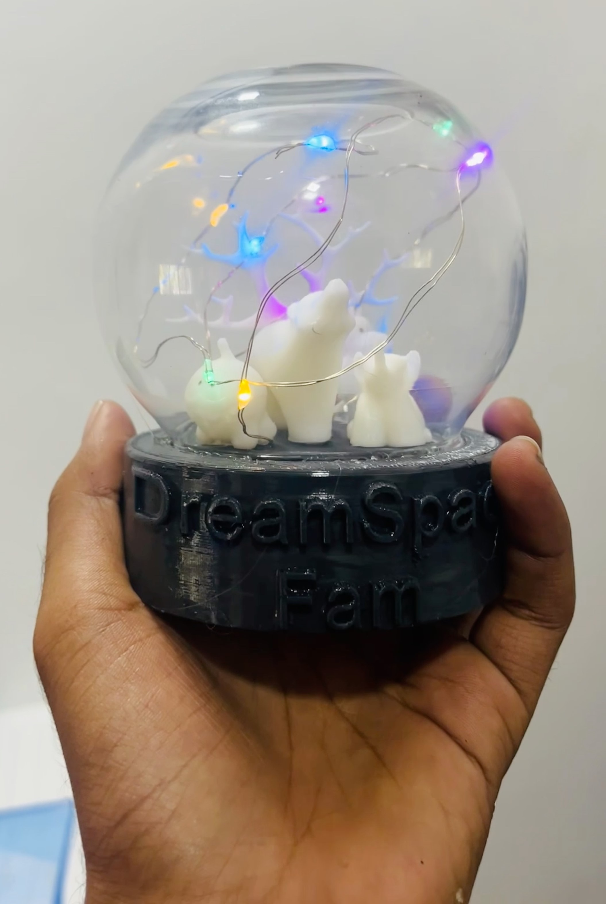
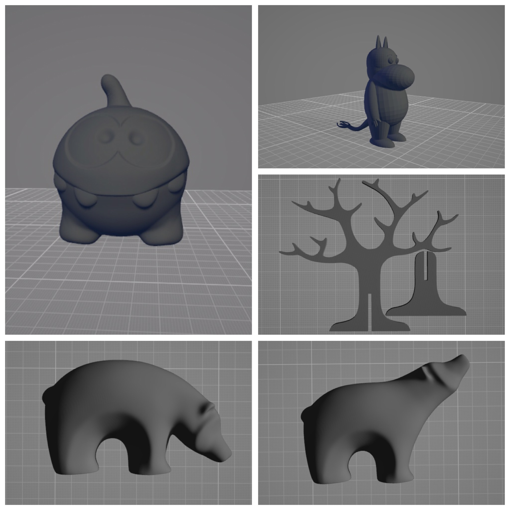
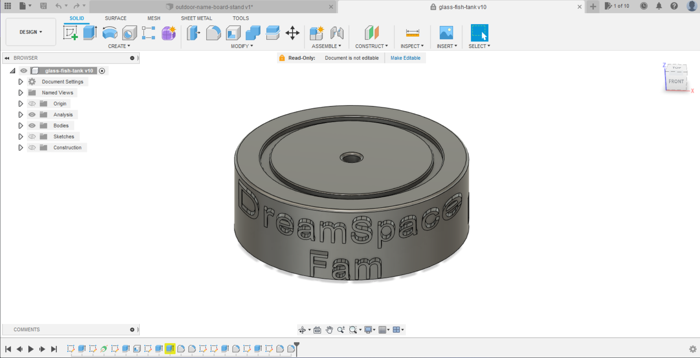

# :crystal_ball:MEMO BOWL - Filled with emotions 

This is a Memo bowl which is expressed emotions. This model combines 3D designing and storytelling. This model was inspired by a snow globe.

Here these characters are representing a few persons. Through this memo bowl, we can express our emotions for someone.

Here you can see the whole process of this Memo bowl - model

## :diamonds:Author

- [Jathujan Mahendran](https://www.linkedin.com/in/jathujanmahendran/)-Community Innovator at DreamSpace Academy

## :diamonds:Acknowledgement

 - [Jerushan Sritharan](https://www.linkedin.com/in/jerushan-sritharan-9017011b4) -   Guardian of Electronics Lab, DreamSpace Academy

## :jigsaw:Material list 
- Small fishbowl
- Led string light
- Batteries and holder
- Switch
- Wires
- Characters - 3D model
- Base - 3D model

## :mag:Process 

### Step-01

Download 3d models characters. 

You can browse on the internet for 3D model characters. There is a lot of open-source sites for 3d models. There are numerous open-source 3D model websites. Choose a model that fits your concept and download it

### Step-02
Design and build a base for the model. Here I used Fusion 360 for 3d designing.

### Step-03
Print all the characters and base model. You can resize the models in Ultimaker Cura for your preference

### Step-04
Setup led string lights and batteries.

### Step-05
Assemble all the components.

## :link:Used Software

- 3D model designing - Autodesk Fusion 360
- Slicing process - Ultimaker Cura
## :label:Source-3D files

1.[Memo bowl base]()

2.[Characters ]()
